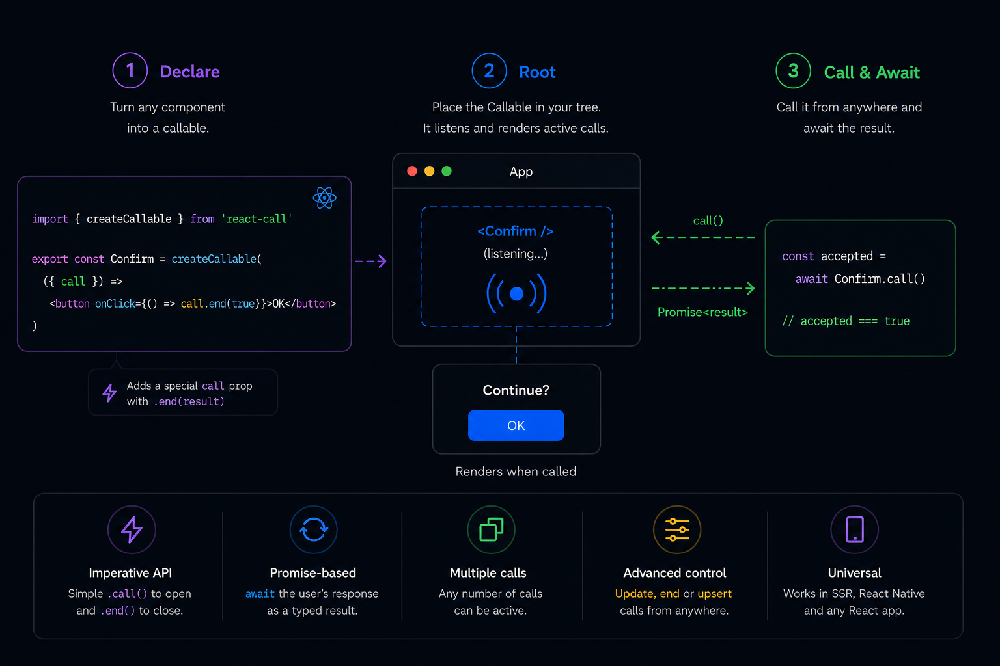

<div align="center">
  <h1>
    ⚛️ 📡 <a href="https://react-call.desko.dev">react-call</a>
  </h1>

  <p><em>Call your React components like async functions — they resolve with a value.</em></p>

  <p>
    <a href="https://www.npmjs.com/package/react-call"></a>
    <a href="https://www.npmjs.com/package/react-call"></a>
    <a href="https://bundlephobia.com/package/react-call"></a>
    <a href="https://www.npmjs.com/package/react-call"></a>
  </p>

  ✓ &lt; 1 KB ✓ No deps ✓ SSR ✓ React Native

  <p>
    <strong><a href="https://react-call.desko.dev">📖 Site with live demos&nbsp;↗</a></strong>
    &nbsp;·&nbsp;
    <a href="https://react-call.desko.dev/examples">Examples gallery</a>
    &nbsp;·&nbsp;
    <a href="#ai-agent-skill">🤖 AI agent skill</a>
    &nbsp;·&nbsp;
    <a href="#getting-started">Getting started</a>
  </p>
</div>

`createCallable()` turns a React component into something you can `await`.

Good fits: confirmations, dialogs, form modals, toasts, notifications, context
menus, pickers — any UI that conceptually returns a value to its caller.


<p align="center">
  <a href="https://react-call.desko.dev">
    
  </a>
</p>

## Contents

- [Getting started](#getting-started)
  - [1. ⚛️ Declare](#1-️-declare)
  - [2. 📡 Root](#2--root)
  - [3. ▶️ Call \& Await](#3-️-call--await)
- [Advanced usage](#advanced-usage)
  - [End from caller](#end-from-caller)
  - [Update](#update)
  - [Upsert](#upsert)
- [Exit animations](#exit-animations)
- [Passing Root props](#passing-root-props)
- [Mutation flow](#mutation-flow)
  - [Optional mutationFn](#optional-mutationfn)
  - [Payload](#payload)
- [Hot reload (HMR)](#hot-reload-hmr)
  - [Vite plugin (optional)](#vite-plugin-optional)
- [Multi-preview hosts (Storybook, Ladle, …)](#multi-preview-hosts-storybook-ladle-)
  - [With static providers](#with-static-providers)
  - [With reactive providers](#with-reactive-providers)
  - [Options](#options)
- [FAQ](#faq)
    - [What if more than one call is active?](#what-if-more-than-one-call-is-active)
    - [Can I place more than one Root?](#can-i-place-more-than-one-root)
- [TypeScript types](#typescript-types)
- [Errors](#errors)
- [Lazy loading](#lazy-loading)
- [SSR](#ssr)
  - [Next.js / RSC](#nextjs--rsc)
- [AI agent skill](#ai-agent-skill)
- [Migrating from v1](#migrating-from-v1)

# Getting started

> [!NOTE]
> These docs cover **v2**, the current stable release. Upgrading from 1.x? See [Migrating from v1](#migrating-from-v1) — or the [v1 README](https://github.com/desko27/react-call/blob/react-call%401.8.2/README.md) for the old API.

```sh
npm install react-call
```

We'll setup a confirmation dialog, but you can setup any component to be callable.

## 1. ⚛️ Declare

```tsx
import { createCallable } from 'react-call'

interface Props { message: string }
type Response = boolean

export const Confirm = createCallable<Props, Response>(({ call, message }) => (
  <div role="dialog">
    <p>{message}</p>
    <button onClick={() => call.end(true)}>Yes</button>
    <button onClick={() => call.end(false)}>No</button>
  </div>
))
```

Along with your props, there is a special `call` prop containing the `end()` method, which you can use to finish the call and return a response. State, hooks and any other React features are totally fine too.

## 2. 📡 Root

The Callable itself is the mounting point — it listens to every call and renders the active ones. Place it anywhere visible when making calls, for instance in `App.tsx`:

```diff
+ <Confirm />
//  ^-- it will render active calls
```

## 3. ▶️ Call & Await

You're all done! Now you can do this anywhere in your codebase:

```tsx
//        ↙ response             props ↘
const accepted = await Confirm.call({ message: 'Continue?' })
```

Want to see more? The [**examples gallery**](https://react-call.desko.dev/examples) has live demos of confirm dialogs, command palettes, toasts, multi-step wizards, drawers and more — each with its source and an **Open in CodeSandbox** button.

# Advanced usage

## End from caller

The returned promise can be used to end the call from the caller scope:

```tsx
const promise = Confirm.call({ message: 'Continue?' })

// For example, on some event subscription
onImportantEvent(() => {
  Confirm.end(promise, false)
})

// And still await the response where needed
const accepted = await promise
```

While the promise argument is used to target that specific call, all ongoing calls can be affected by omitting it:

```tsx
// All confirm calls are ended with `false`
Confirm.end(false)
```

## Update

The returned promise can also be used to update the call props on the fly:

```tsx
const promise = Alert.call({ message: 'Starting operation...' })
await asyncOperation()
Alert.update(promise, { message: 'Completed!' })
```

While the promise argument is used to target that specific call, all ongoing calls can be affected by omitting it:

```tsx
// All alert calls are updated with the new message prop
Alert.update({ message: 'Completed!' })
```

## Upsert

If you need to ensure only one instance of a component is active at a time, use `upsert()` instead of `call()`. This is particularly useful for notifications, loading states, or any singleton-like UI:

```tsx
// First call creates a new instance
const promise1 = Toast.upsert({ message: 'Loading...' })

// Second call updates the existing instance instead of creating a new one
const promise2 = Toast.upsert({ message: 'Almost done...' })

// promise1 === promise2 (same instance)
console.log(promise1 === promise2) // true
```

The `upsert()` method behaves as follows:

- Creates a new instance if no upsert instance is currently active
- Updates the existing upsert instance if one is already active
- Does not affect normal `call()` instances
- Creates a new instance if the previous upsert instance was ended

```tsx
// Example: progress notification that updates itself
const showProgress = async () => {
  Toast.upsert({ message: 'Starting download...' })

  for (let i = 0; i <= 100; i += 10) {
    await new Promise(resolve => setTimeout(resolve, 100))
    Toast.upsert({ message: `Progress: ${i}%` })
  }

  Toast.end()
}
```

# Exit animations

To animate the exit of your component when `call.end()` is run, just pass the duration of your animation in milliseconds to createCallable as a second argument:

```diff
+ const UNMOUNTING_DELAY = 500

export const Confirm = createCallable<Props, Response>(
  ({ call }) => (
    <div
+     className={call.ended ? 'exit-animation' : '' }
    />
  ),
+ UNMOUNTING_DELAY
)
```

The `call.ended` boolean may be used to apply your animation CSS class.

# Passing Root props

You can also read props from Root, which are separate from the call props. To do that, just add your RootProps type to createCallable and pass them to your Root.

Root props will be available to your component via `call.root` object.

```diff
+ type RootProps = { userName: string }

export const Confirm = createCallable<
  Props,
  Response,
+ RootProps
>(({ call, message }) => (
  ...
+   Hi {call.root.userName}!
  ...
))
```

```diff
<Confirm
+ userName='John Doe'
/>
```

You may want to use Root props if you need to:

- Share the same piece of data to every call
- Use something that is availble in Root's parent
- Update your active call components on data changes

# Mutation flow

Use `useMutationFlow` from `react-call/mutation-flow` to wire the call to an async action. The hook manages `pending` for you, and because closing the call requires an explicit `call.end()`, a `mutationFn` that doesn't reach `end` leaves the dialog open — the user can retry without losing their place.

```tsx
import { createCallable } from 'react-call'
import { useMutationFlow, type MutationFn } from 'react-call/mutation-flow'

type Props = { mutationFn: MutationFn<boolean> }

export const Confirm = createCallable<Props, boolean>(
  ({ call, mutationFn }) => {
    const submit = useMutationFlow(call, mutationFn)
    return (
      <div role="dialog">
        <button disabled={submit.pending} onClick={() => submit()}>Yes</button>
        <button onClick={() => call.end(false)}>No</button>
      </div>
    )
  },
)

await Confirm.call({
  mutationFn: async (call) => {
    await api.delete(id)
    call.end(true)
  },
})
```

The `mutationFn` receives the call context and decides when — if ever — to close.

## Optional mutationFn

If a caller may omit `mutationFn`, type the prop as optional and chain `.orEnd(value)` at the callsite. The chain fires only when no `mutationFn` was provided; with one, it's a no-op.

```tsx
type Props = { mutationFn?: MutationFn<boolean> }

export const Confirm = createCallable<Props, boolean>(({ call, mutationFn }) => {
  const submit = useMutationFlow(call, mutationFn)
  return (
    //                       closes with `true` if no mutationFn ↓
    <button disabled={submit.pending} onClick={() => submit().orEnd(true)}>Yes</button>
  )
})
```

## Payload

`MutationFn` is `<Response, Payload>`-shaped. `Payload` is the second generic and defaults to `void`, so `submit()` takes no argument unless you opt in.

```tsx
type Props = { mutationFn: MutationFn<boolean, { name: string }> }
//                                             ↑ payload type

export const Create = createCallable<Props, boolean>(({ call, mutationFn }) => {
  const [name, setName] = useState('')
  const submit = useMutationFlow(call, mutationFn)
  return (
    <div role="dialog">
      <input value={name} onChange={(e) => setName(e.target.value)} />
      <button onClick={() => submit({ name })}>Create</button>
    </div>
  )
})

await Create.call({
  mutationFn: async (call, payload) => {
    //                       ↑ typed as { name: string }
    await api.create(payload.name)
    call.end(true)
  },
})
```

The payload is typed end-to-end — the trigger callsite and the handler share the same `Payload` generic — and it lives at the callsite, so triggers in the same component can forward different payloads (useful for pickers, where each option carries its own data).

# Hot reload (HMR)

`createCallable` is Fast Refresh friendly — edits to your callable's source hot-update in place without a full page reload.

If you want the **open dialog to survive across saves** of its own source, set a `displayName` on the callable:

```diff
  export const Confirm = createCallable(({ call, message }) => (
    <div role="dialog">
      {/* ... */}
    </div>
  ))
+ Confirm.displayName = 'Confirm'
```

Callables without a `displayName` still HMR — only the dialog you're editing resets; sibling state in the rest of the page is preserved either way.

## Vite plugin (optional)

If you're on Vite, the bundled plugin auto-injects the `displayName` line so you don't have to write it:

```ts
// vite.config.ts
import react from '@vitejs/plugin-react'
import reactCall from 'react-call/vite'

export default {
  plugins: [react(), reactCall()],
}
```

With the plugin enabled, every top-level `(export) const X = createCallable(...)` gets `X.displayName = 'X'` appended at dev time only — no source change, no production overhead.

# Multi-preview hosts (Storybook, Ladle, …)

Tools like Storybook (autodocs page), Ladle, Histoire, and react-cosmos render multiple stories side-by-side. If each story's decorator mounts `<Confirm />`, every preview registers its own listener — and `Confirm.call()` throws `Multiple instances of <Root> found!` the moment any preview's button is clicked.

`react-call/host` exposes a `mount()` helper that puts a single Root in a body-level `<div>` outside the previews. Call it once from your host's preview entry file (e.g. `.storybook/preview.tsx`); your story decorators don't need to render Callables at all.

```tsx
// .storybook/preview.tsx
import { mount } from 'react-call/host'
import { Confirm } from '../src/Confirm'

mount(<Confirm />)

const preview = { /* normal Storybook config */ }
export default preview
```

That's it for the simple case. Your app's own `<Confirm />` mount stays where it is — this helper only handles the preview environment. If you were previously rendering `<Confirm />` from inside a story decorator, drop it from the decorator. The mount is idempotent under HMR — saving your `preview.tsx` doesn't double-mount, and an open `Confirm.call()` survives the edit.

## With static providers

The Confirm renders in its own React tree, separate from every story preview. It does not inherit context from your story decorators — if it needs a theme, locale, or router, pass them via `wrapper`:

```tsx
import { mount } from 'react-call/host'
import { ThemeProvider } from '@mui/material/styles'
import { lightTheme } from '../src/themes'
import { Confirm } from '../src/Confirm'

mount(<Confirm />, {
  wrapper: ({ children }) => (
    <ThemeProvider theme={lightTheme}>{children}</ThemeProvider>
  ),
})
```

## With reactive providers

A static wrapper captures its props once. If your providers depend on Storybook globals — toolbar toggles, args, parameters — subscribe to them inside the wrapper via `useGlobals` from `@storybook/preview-api`:

```tsx
import type { ReactNode } from 'react'
import { mount } from 'react-call/host'
import { useGlobals } from '@storybook/preview-api'
import { ThemeProvider } from '@mui/material/styles'
import { lightTheme, darkTheme } from '../src/themes'
import { Confirm } from '../src/Confirm'

function ReactiveTheme({ children }: { children: ReactNode }) {
  const [{ theme = 'light' }] = useGlobals()
  return (
    <ThemeProvider theme={theme === 'dark' ? darkTheme : lightTheme}>
      {children}
    </ThemeProvider>
  )
}

mount(<Confirm />, { wrapper: ReactiveTheme })
```

External stores (Zustand, Jotai, Redux, anything backed by `useSyncExternalStore`) work the same way — both trees subscribe to the same source of truth.

## Options

```tsx
mount(element, {
  wrapper?: ComponentType<{ children: ReactNode }>,
  container?: HTMLElement, // default: <div data-react-call-host> in document.body
})
```

Works wherever React DOM does.

# FAQ

### What if more than one call is active?

`<Root>` works as a call stack. Multiple calls will render one after another (newer below, which is one on top of the other if your CSS is position fixed/absolute).

### Can I place more than one Root?

No. There can only be one `<Root>` mounted per createCallable(). Avoid placing it in multiple locations of the React Tree loaded at once, an error will be thrown if so.

If you specifically need this in a sandbox host (Storybook autodocs, Ladle, …), see [Multi-preview hosts](#multi-preview-hosts-storybook-ladle-) for the supported pattern.

# TypeScript types

You won't need them most likely, but if you want to split the component declaration and such, the public types are available as named exports:

```tsx
import type { UserComponent, CallContext } from 'react-call'
```

Type | Description
--- | ---
CallFunction<Props?, Response?> | The call() method
UpsertFunction<Props?, Response?> | The upsert() method
CallContext<Props?, Response?, RootProps?> | The call prop in UserComponent
PropsWithCall<Props?, Response?, RootProps?> | Your props + the call prop
UserComponent<Props?, Response?, RootProps?> | What is passed to createCallable
Callable<Props?, Response?, RootProps?> | What createCallable returns

# Errors

Error | Solution
--- | ---
No \<Root> found! | You forgot to place the Root, check [Rooting section](#2--rooting). If it's already in place but not present by the time you call(), you may want to place it higher in your React tree. If you're getting this error on the server see [SSR section](#ssr).
Multiple instances of \<Root> found! | You placed more than one Root, check [Rooting section](#2--rooting) as there is a warning about this. If you're hitting this in Storybook autodocs or another multi-preview tool, see [Multi-preview hosts](#multi-preview-hosts-storybook-ladle-).

# Lazy loading

If your callable carries a heavy payload (rich-text editor, chart library, big form), wrap it with `React.lazy` so the chunk only ships when the call fires.

```tsx
import { createCallable } from 'react-call'
import { lazy, Suspense } from 'react'

const Confirm = createCallable(
  lazy(() => import('./Confirm')),
)

<Suspense fallback={<Spinner />}>
  <Confirm />
</Suspense>
```

- The lazy module must default-export the user component (React.lazy requirement).
- The first call waits for the chunk to download — pick a `fallback` that signals "something's loading"; `null` works but the user sees nothing happen on click.
- Subsequent calls are instant; the chunk is cached by the browser.

# SSR

✅ The react-call setup supports [Server Side Rendering](https://nextjs.org/docs/pages/building-your-application/rendering/server-side-rendering). This means both createCallable and Root component are fine if run or rendered on the server.

However, bear in mind that because the call() method is meant to be triggered by user interaction, it is designed as a client-only feature.

> [!CAUTION]
> If call() is run on the server a "No \<Root> found!" error will be thrown. As long as you don't run the call() method on the server you'll be fine.

## Next.js / RSC

Mark the file where you call `createCallable(...)` as a Client Component (the lib uses `useSyncExternalStore`):

```diff
+ 'use client'

export const Confirm = createCallable(...)
```

Then `<Confirm />` mounts cleanly from any Server Component (e.g. `app/layout.tsx`).

# AI agent skill

Using an AI coding assistant (Claude Code, Cursor, …)? Install the official react-call skill so it writes correct Callables — the Declare→Root→Call model, `call` vs `upsert`, mutation flow, multi-preview hosts, SSR, the single-Root rule, and the canonical vocabulary:

```sh
npx skills add desko27/react-call --skill react-call
```

The `--skill react-call` flag pins exactly this skill (this repo also hosts the maintainers' internal workflow skills, which you don't want). Powered by [`skills`](https://github.com/vercel-labs/skills) — works with any agent it supports.

# Migrating from v1

If you're upgrading from 1.x, see the [full v2 changelog](packages/react-call/CHANGELOG.md). The breaking changes in short:

- **`<Confirm />` is the canonical Root.** The `<Confirm.Root />` form is still exported as a backwards-compatible alias but is soft-deprecated (ADR-0013).
- **Public types are flat named exports**, not under the `ReactCall` namespace (ADR-0015). Migration is a mechanical find-and-replace:

  | Before | After |
  | --- | --- |
  | `ReactCall.Function` | `CallFunction` |
  | `ReactCall.UpsertFunction` | `UpsertFunction` |
  | `ReactCall.Context` | `CallContext` |
  | `ReactCall.Props` | `PropsWithCall` |
  | `ReactCall.UserComponent` | `UserComponent` |
  | `ReactCall.Callable` | `Callable` |

- **`CallContext` no longer leaks `promise`, `resolve`, or `isUpsert`.** Replace `call.resolve(value)` with `call.end(value)`. The other two were internal and had no public-API equivalent.
- **`"Multiple instances of <Root> found!"` now fires at `call()` time**, not at Root mount time (ADR-0001) — making it compatible with `React.lazy` inside `<Suspense>`, React StrictMode's double-invoke, and HMR re-mounts. Tests of the form `expect(() => render(<><Root /><Root /></>)).toThrow(...)` should now assert at the `call()` site instead.
